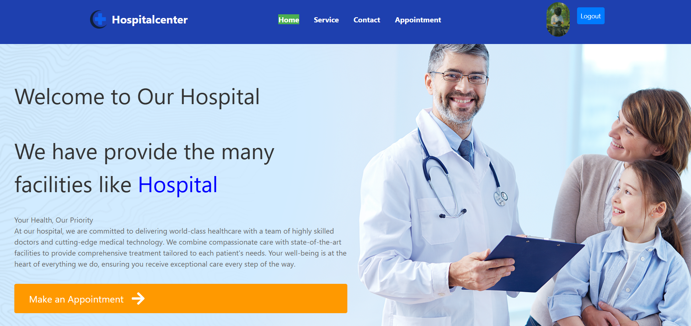

# Hospital Management System (Doctor Appointment Booking)

A full-stack hospital management web application built with the MERN stack (MongoDB, Express.js, React.js, Node.js). This project allows users to book appointments and admins to manage those appointments through an admin panel. Email notifications are also integrated.

---

## 👨‍💻 Developed By

- **Name**: karan
- **Roll No**: 2203002088
- **Course**: BCA (6th Semester)

---

## 🚀 Features

### User Side:
- Book an appointment online
- Get email confirmation after booking
- Contact form (sends a professional thank-you email)

### Admin Panel:
- View all appointment requests
- Approve / Reject appointment requests
- Assign a doctor, date & time (with email notification to patient)
- Edit appointment details (also triggers updated email)
- Delete appointments

---

## 🛠️ Tech Stack

| Tech             | Use                          |
|------------------|------------------------------|
| **MongoDB**      | Database                     |
| **Express.js**   | Backend framework            |
| **React.js**     | Frontend library             |
| **Node.js**      | Backend runtime              |
| **Nodemailer**   | Email service integration    |
| **Tailwind CSS** | Styling                      |

---

## 📦 Project Structure

```bash
HospitalManagement/
├── Backend/               # Node.js & Express backend
│   ├── models/
│   ├── routes/
│   ├── controllers/
│   └── server.js
│
├── Frontend/
│   └── hospitalmanagement/
│       ├── src/
│       │   ├── Pages/         # Pages including Admin panel
│       │   ├── Component/
│       │   ├── api/
│       │   └── App.jsx
│       ├── public/
│       └── package.json
│
└── README.md


## 🔧  Prerequisites
Before you begin, make sure you have the following installed:

Node.js (v16 or later)
You can download Node.js.

MongoDB
You can either use a local MongoDB installation or MongoDB Atlas for a cloud database.

npm or yarn
npm comes with Node.js. If you prefer using yarn, you can install it.


⚙️ Environment Setup
To set up the backend, create a .env file in the Backend directory with the following variables:

PORT=4000
MONGODB_URI=your_mongodb_connection_string
EMAIL_USER=your_gmail_or_email
EMAIL_PASS=your_email_password_or_app_password

Replace your_mongodb_connection_string with the connection string of your MongoDB database (local or Atlas).

For EMAIL_USER and EMAIL_PASS, use your email and password (you may need to create an app-specific password if using Gmail, which can be done from your Google account settings).


📥 How to Run the Project'

To start frontend:

First step: cd Frontend
Second step: cd hospitalmanagement
Third step: npm start
 

Start the Backend Server:

First step: cd Backend
second step: npx nodemon index


The server will start and run on http://localhost:4000


📧 Email Notifications
Triggered Emails:
After user books an appointment: Confirmation email is sent.

After admin assigns doctor/date/time: Doctor assignment email is sent.

After user submits the contact form: Thank-you email is sent.

When admin edits an appointment: Updated details are sent to the user.


🛠️ Troubleshooting
CORS Issues
If you encounter CORS issues while running the frontend and backend on different ports, you can resolve this by using the cors package on the backend.

Email Not Sending
If you're using Gmail to send emails, ensure that "Less secure apps" are allowed, or use App Passwords for Gmail.





📄 License
This project is built for academic purposes and not intended for production use.


##🙏 Acknowledgements
Thanks to the faculty for guiding the project and to all open-source contributors whose libraries were used.

## Key Updates:
1. Added installation instructions for `Node.js`, `MongoDB`, and the necessary dependencies.
2. Clarified how to set up the environment variables (`.env` file).
3. Detailed the process for starting both the backend and frontend, including the appropriate commands.


